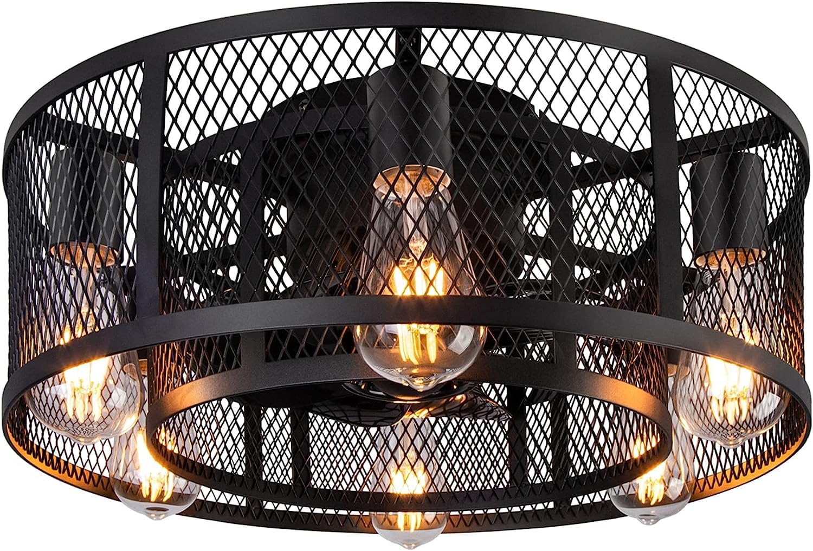
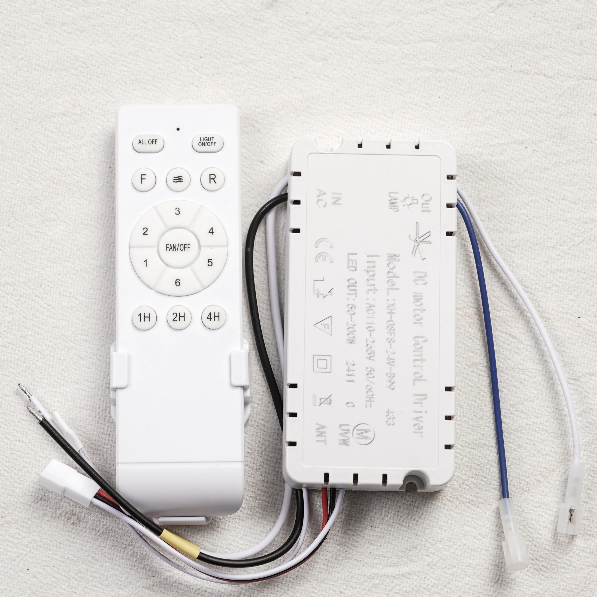
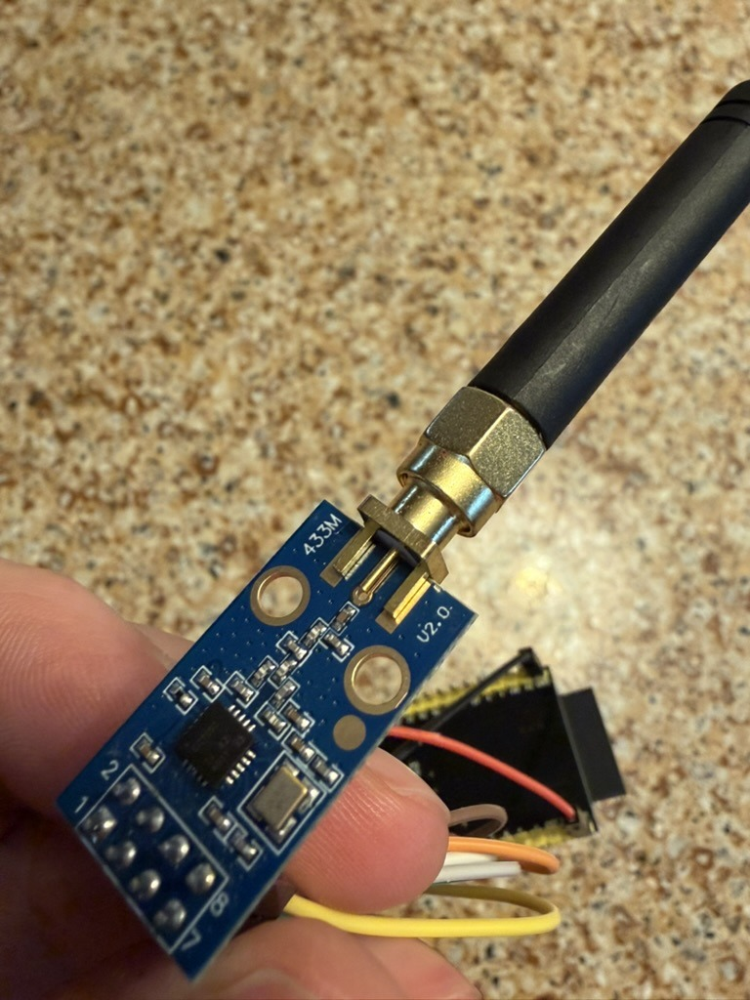

# EV1527 / B99 433 MHz Ceiling-Fan RF Bridge for Home Assistant

Control cheap 433 MHz OOK ceiling-fan + light remotes (the **XH-0SFS-24V-B99**
family and other EV1527/PT2262-class units) from Home Assistant, using an
**ESP32-S3 + CC1101** running ESPHome with the RadioLib external component.

This repo is an **RF bridge**, shipped in **two variants** (see
[Two variants](#two-variants)): a **stateless, transmit-only** one that exposes
one Home Assistant button per remote command, and a **stateful** one that
exposes native fan + light entities with on-device assumed state — and that
**also listens**: it decodes presses from the physical remotes and mirrors them
into the entities, live in HA (see
[The stateful variant](#the-stateful-variant) for what to expect, and its
limits).

It is the product of a long, dead-end-heavy reverse-engineering effort. The
[What we learned](#what-we-learned-the-hard-won-part) section documents both the
solution and the four separate things that had to be fixed to get there, plus a
detailed account of **what is proven vs. what is inferred**, so the next person
doesn't repeat the loops.

Everything here is a **reference implementation provided as-is — anyone using
any of it does so entirely at their own risk**. Parts of the overall system
(the fan controller) are mains-powered equipment installed in buildings. See
[License and disclaimer](#license-and-disclaimer).

---

## Two variants

| Variant | File | What HA sees | State |
|---------|------|--------------|-------|
| **Stateless** (reference) | `ceiling-fans-stateless.yaml` | 15 buttons per fan, 1:1 with RF commands | None on device — model state in HA if you want it |
| **Stateful** (flagship) | `ceiling-fans-stateful.yaml` | A native **fan entity** (on/off, 6 speeds, direction, "Breeze" preset) + a **light entity** + timer/All-Off buttons per fan | Assumed state on the device, restored from flash across reboots — and **updated by listening to the physical remotes** (clean RF signal required; see below) |

Both share the same hardware, wiring, protocol values, and bench-proven transmit
engine. **Flash one variant per board** — switching variants creates a new device
in Home Assistant (delete the stale one).

Pick the **stateless** variant if you want raw primitives to script against, or
the smallest possible config to adapt to a different fan. Pick the **stateful**
variant if you want the fan to look and act like a fan in HA (voice assistants,
scenes, HomeKit bridge, the standard fan card), want wall-remote presses
reflected in HA, and accept optimistic state — see
[The stateful variant](#the-stateful-variant) for exactly what it tracks and how
it can drift.

---

## TL;DR for adopters

1. Your fan must be an EV1527/PT2262-class **OOK** remote (most cheap 433 MHz
   fan/light remotes are). Confirm via [Is my fan compatible?](#is-my-fan-compatible).
2. You must extract **your own** remote's 20-bit ID and 4-bit checksum key `K`
   (they are unique per remote). See [Capturing & decoding](#capturing--decoding-your-remote).
   This is the hard 90% of adoption — the YAML is the easy 10%.
3. Wire the CC1101 per [Wiring](#wiring), install the
   [RadioLib component](#dependencies), pick a [variant](#two-variants), paste
   your ID/K/frequency into its `substitutions:` block, and flash.

> **Note on the name.** "EV1527" here is an **inference from the
> signaling**, not a part number we read off the chip. We never decapped the
> encoder. We identified the family from its behavior — the sync-header
> requirement, the 3:1 / 1:3 OOK bit geometry, and a fixed 20-bit ID + checksum —
> which matches the EV1527/PT2262 learning-code family and `rc-switch` protocol 1.
> If you have a fan that behaves the same but uses a different chip, this will
> still likely work; if your timings differ, you'll need to re-measure them.

---

## Hardware

| Part | Used here | Notes |
|------|-----------|-------|
| MCU | ESP32-S3-DevKitM-1 | Any ESP32 with a free SPI bus + GPIOs should work; pin numbers below are S3. |
| Radio | CC1101 (E07-M1101D) | 433 MHz module. **Power from 3V3, never 5V.** |
| Fan fixture | [Ohniyou Cage 21-inch Flush-Mount Bladeless](https://ohniyou.com/products/ohniyou-cage-21-inch-flush-mount-bladeless-ceiling-fan-006-%E5%A4%8D%E5%88%B6-006%E5%A4%9A%E5%B1%9E%E6%80%A7-2-%E5%A4%8D%E5%88%B6) | The specific ceiling fan validated against. |
| Fan RF receiver + remote | `XH-0SFS-24V-B99` "DC motor Control Driver" + handheld remote | The 433 MHz OOK receiver built into the fan and its stock 15-button remote — what this bridge emulates. The middle characters were illegible on our unit; the full model comes from the label in [Ohniyou's replacement-kit listing](https://ohniyou.com/products/universal-ceiling-fan-with-light-remote-control-kit-black-1) (same photo as below — also the replacement-part source), matching sibling model `XH-0SFS-24V-TM`. |

The **B99 receiver** is a DC-motor (ECM) fan controller wired inline between AC
mains and the fan: a mains input, a dimmable LED **LAMP** output, a 3-phase
**UVW** motor output, and a **433 MHz** OOK receiver on an **ANT** antenna
terminal. Its stock **handheld remote** carries exactly the 15 buttons of the
[command map](#command-map-5-bit-identical-across-b99-units): All Off, Light
On/Off, F/R direction, the "natural wind" variable mode, a 1–6 speed dial with a
Fan/Off center, and 1H/2H/4H timers — the full command set this bridge
reproduces.

<p align="center">
  
  
</p>
<p align="center"><sub>Left: the fan fixture. Right: the B99 "DC motor Control Driver" receiver (note the LAMP / UVW / ANT terminals) and its stock 15-button remote.</sub></p>

### Wiring

Transmit rides **GDO0** with open-drain + pullup (this is **required** — see
[Fix #3](#fix-3-the-transmit-pin--gdo0-open-drain--pullup)):

```
CC1101            ESP32-S3
------            --------
GDO0   ───────►   GPIO5     (transmit data; open-drain + pullup in YAML)
CSN    ───────►   GPIO10
SCK    ───────►   GPIO12
MOSI   ───────►   GPIO11
MISO   ───────►   GPIO13
VCC    ───────►   3V3       (NOT 5V)
GND    ───────►   GND
GDO2   ───────►   GPIO6     (receive data; needed only by the stateful variant's RX)
```

Receive — both the **stateful variant's built-in RX** and the `sniffer.yaml`
capture tool — listens on **GDO2 → GPIO6** (the firmware routes RX data to
GDO2 at boot; GDO0 is owned by transmit in the bridges). The sniffer never
transmits, so it can equally read GDO0 by setting its `pin_rx: "5"` (see
[Capturing](#capturing--decoding-your-remote)). If you only run the stateless
variant, leave GDO2 unconnected.

---

## Dependencies

- **ESPHome** (validated on 2026.6.3).
- **RadioLib external component:**
  [`github://juanboro/esphome-radiolib-cc1101`](https://github.com/juanboro/esphome-radiolib-cc1101).
  This is **not optional** — see [Fix #2](#fix-2-stock-esphome-cc1101-transmit-is-broken).
- **`esp-idf` framework** (not Arduino) — RadioLib needs it here.
- A `secrets.yaml` providing `wifi_ssid`, `wifi_password`, and
  `esp_433_radio__encryption_key`.

---

## Files

| File | Role |
|------|------|
| `ceiling-fans-stateless.yaml` | The **stateless** variant: two fans (Office, Guest) as repeated button blocks sharing one transmit engine. The minimal reference — also the protocol-provenance record. |
| `ceiling-fans-stateful.yaml` | The **stateful** variant: native fan + light entities per fan, on-device assumed state, same transmit engine. See [The stateful variant](#the-stateful-variant). |
| `sniffer.yaml` | **Capture tool / RF bench**, not a bridge: receive-only, with a **web UI** for tuning the radio (frequency, bitrate, bandwidth), switching the log between B99 decode and raw pulses, restarting the radio, and reading RSSI + capture counters. Decodes remote presses off the air and logs `id`/`K`/`cmd`/`cnt` directly. See [Plan A](#plan-a--let-the-firmware-decode-for-you-recommended). |

> Both configs are intentionally **single readable flat files** with some
> repetition between fans, rather than clever multi-file packages. See
> [Scaling up](#scaling-up--modularity) for the modular approach if you outgrow
> that.

---

## Setup

1. **Install the RadioLib component** — it's referenced via `external_components:`
   in the config, so ESPHome fetches it on first compile. Nothing manual needed
   beyond having network access at build time.

2. **Capture your remote's ID and K** — see
   [Capturing & decoding](#capturing--decoding-your-remote). You cannot skip this;
   the values in the repo (`0x003B9`/`K=0xB`, `0x18999`/`K=0xA`) are *our* remotes.

3. **Edit `substitutions:`** in your chosen [variant](#two-variants):
   ```yaml
   substitutions:
     office_id_dec: "953"        # YOUR 20-bit ID, in DECIMAL (0x003B9 = 953)
     office_k:      "11"         # YOUR checksum key, in DECIMAL (0xB = 11)
     office_freq_mhz: "433.92"   # carrier frequency
   ```
   Note the values are **decimal**, with the hex shown in a comment. Convert your
   captured hex ID/K to decimal.

4. **Flash** via the ESPHome dashboard (Install → OTA or USB).

5. **Stateless variant**: the device exposes one HA button per command (e.g.
   `button.office_light`, `button.office_speed_3`, `button.office_all_off`) —
   drive them directly or build HA-side logic on top (see
   [Architecture](#architecture-why-stateless)). **Stateful variant**: the device
   exposes `fan.office_fan`, `light.office_light`, and timer/All-Off buttons (see
   [The stateful variant](#the-stateful-variant)).

---

## Architecture: why stateless

*(This section explains the **stateless variant**'s philosophy. The
[stateful variant](#the-stateful-variant) is its deliberate counterpoint: it
accepts the desync risks described here in exchange for native fan/light UX,
and mitigates them explicitly.)*

In the stateless variant the ESP is a **pure transmitter**. Each button emits
exactly one RF frame and the device tracks no fan/light state. This is
deliberate:

- **A transmitter cannot observe the fan.** Any state the firmware claims is a
  guess that desyncs the moment someone uses the physical wall remote or the fan
  loses power. Pushing state into Home Assistant (where it can be modeled with
  helpers and corrected) keeps the firmware simple and reliable.
- **The fan/light protocol is mostly absolute, except the light.** Speed 1–6,
  Fan Off, Forward, Reverse are *absolute* commands. The **Light command is a pure
  toggle** — there is no discrete "light on" / "light off" in this protocol. So
  even with perfect state tracking, the light can only ever be tracked
  optimistically. This is a protocol limit, not a design shortcut.

If you're running the stateless variant and want a single "Off / Fwd 1–6 /
Rev 1–6" control with (optimistic) state, build it **in Home Assistant** with an
`input_select` + an automation that calls these buttons — or just run the
[stateful variant](#the-stateful-variant), which does that modeling on-device.

### The rolling counter (the one piece of retained state)

The 32-bit frame carries a 3-bit counter that the **physical remotes increment by
one per button press** and hold constant across the ~10 repeats of a single press.
This repo keeps a **per-fan counter** (`ctr_office`, `ctr_guest`) and advances it
on each transmit, so a controller that validates the counter will accept the
frames. This is the only device-side state, and it's part of the *protocol*, not
the UX.

> **What we don't definitively know:** whether the fan actually *validates* the
> counter or ignores it. We kept per-fan counters for fidelity to the real remotes
> rather than because we proved the fan rejects a static counter. If you want
> maximum simplicity you could use a single shared counter; we chose fidelity.

---

## The stateful variant

`ceiling-fans-stateful.yaml` turns each fan into a native ESPHome **fan entity**
(on/off, 6-step speed slider, forward/reverse, a "Breeze" preset for the
Variable command) plus a **light entity**, with **assumed state** kept in
flash-restored globals on the device. Native entities mean the standard HA fan
card, scenes, voice assistants, and the HomeKit bridge all work without any
HA-side config.

**What HA sees per fan:** `fan.<name>_fan`, `light.<name>_light`, and buttons
for Timer 1h/2h/4h, All Off, and a diagnostic "Light State Invert".

**Onboard status LED (optional).** The stateful variant drives the ESP32-S3
dev board's onboard WS2812 as a device-status indicator (`internal: true` —
it never appears in HA):

| Color | Meaning |
|---|---|
| red | a component is in error state |
| yellow | a component warning |
| orange | Wi-Fi down |
| cyan pulse (~1.5 s) | RX decoded a wall-remote press |
| white pulse (~0.6 s) | transmitting |
| blue | Wi-Fi up, no HA client connected |
| dim green | healthy |

**Dark Mode.** A `switch.dark_mode` entity (config category) fully extinguishes
the status LED, so the board doesn't light a bedroom. It's a plain switch, so
Home Assistant can automate it (on at bedtime, off at sunrise) or drive it by
voice, and the setting **survives reboots and OTA updates** — an update at 2am
won't relight it. Dark is absolute: even a component error stays dark, since HA
reports failures far better than a red pixel at 3am.

> **It cannot make the board *totally* dark.** The ESP32-S3-DevKitM-1's 3.3 V
> power LED is wired to the power rail, not to a GPIO — Espressif's user guide
> says it simply *"turns on when the USB power is connected."* No firmware can
> switch it off. Cover it with opaque tape, or remove the LED or its series
> resistor, if you need true darkness. (The CC1101 module has no LED.)

The data pin is the `pin_status_led` substitution (DevKitM-1 = GPIO48; some
DevKitC-1 v1.0 boards = GPIO38). A WS2812 can't be probed at runtime, but
driving a pin with no LED attached is harmless — boards without one can keep
the feature or delete the six blocks fenced `STATUS-LED (n/6)` in the YAML.

An **external NeoPixel works identically**: wire its DIN to any free
output-capable GPIO (avoid this project's 5/6/10–13 and the S3's flash pins
26–32) and point `pin_status_led` at it. The ESP drives 3.3 V data — power
the pixel from 3V3 (fine for an indicator) or level-shift if you run it at
5 V; a ~330 Ω series resistor on the data line is good practice off-board.
If colors come out swapped, adjust `rgb_order`; other chipsets are a
`chipset:` change, and a multi-LED strip just floods one color
(`num_leds: N`).

> Please note if you adapt this: the LED entry pins `rmt_symbols: 48`. The
> `esp32_rmt_led_strip` default on the S3 is 192 — the chip's **entire** RMT
> transmit memory pool — which starves `remote_transmitter` at boot
> (`no free tx channels`, radio TX dead, LED red). The failure only appears
> at runtime, never at compile time.

**How it transmits.** All fan logic lives in one *reconciler* per fan: on every
entity state change it diffs the commanded state against the assumed physical
state and transmits only the differences (the protocol is mostly absolute, so
each difference is one frame). Transmissions are serialized through a queued
script (~450 ms apart) so slider drags and multi-frame settles can't overlap on
the air.

**How it listens (work in progress).** The radio parks in receive between
transmits and decodes B99 frames from the physical remotes (RX data on
GDO2 → GPIO6). A press whose ID **and** checksum key match a configured fan is
mirrored into the entities — no re-transmit — and Home Assistant updates live;
the rolling counter also resyncs so our next transmit continues the remote's
sequence. Presses from **unknown** remotes are logged (tag `rx_discover`) with
their decoded `id` and `K` — which is how you onboard a new remote straight
from the web-page log. This is not hypothetical: the shipped config's **third
fan was added exactly this way** — a new controller's `rx_discover` line gave
its `id` and `K`, which dropped straight into a new fan block. Validated with
all three of the author's fans.

The **goal** is to keep all three parties — the fan controller, the physical
remote, and this ESP — in sync where possible. Please note the limits:

- **The RF signal must be clean for reliable decode.** The fan's purpose-built
  receiver is far more forgiving than our general-purpose CC1101: most of our
  remotes decode perfectly, while one operates its fan reliably yet arrives
  too noisy for us to decode consistently. (Register-tuning experiments — RX
  data rate, DN022 AGC — both made things worse and were reverted; the git
  history documents them. Carrier-offset measurement via SDR is the open
  diagnostic lead.)
- **The protocol is one-way.** The fan controller never acknowledges anything,
  so there is no confirmation that a command — ours or the remote's — was
  actually acted on. Sync drift cannot be *prevented*, only reduced and
  repaired (All Off, Light State Invert).
- **Half-duplex.** The radio is deaf during its own ~400 ms transmits; a
  remote press in exactly that window is missed.

Treat the three-way sync as **best-effort and a work in progress** — useful,
not guaranteed.

**Please note: "assumed" state can drift.** A transmitter still can't observe
the fan; this variant *chooses* optimistic tracking and mitigates the drift
paths:

| Drift path | Behavior / remedy |
|---|---|
| Light (protocol-level **toggle**, no discrete on/off) | Entity transmits the toggle only when commanded state ≠ assumed state. RX flips the assumption when it decodes a wall-remote Light press (clean signal required); if it still drifts, press **Light State Invert** — flips the assumption without transmitting. |
| Timer buttons | Fire-and-forget; when the fan's own timer fires, the fan entity stays "on" until your next command. Deliberate — timer-cancellation semantics are unverified. |
| Fan power cycle | Desyncs everything until the next decoded remote press or command. |
| Anything else | **All Off** transmits the atomic all-off frame and force-syncs fan + light entities to off — it is the manual resync-to-known-state affordance. |

**Boot behavior: nothing is ever transmitted at boot.** A suppress guard boots
armed-off, the saved assumed state is pushed into the entities silently, and
only then is transmit enabled. OTA updates and reboots never disturb a running
fan.

**Direction while off** is displayed immediately but transmitted on the next
turn-on (as speed-then-direction, ~450 ms apart). This is deliberate: any
command — F/R included — **starts a stopped fan** (verified), so transmitting
the direction change immediately would surprise-start it.

**Bench status:** working with both of our fans in normal use — TX control and
RX mirroring (with the clean-signal remote) validated. Also verified: **any
command (speeds, F/R) starts a stopped fan**, and the controller **remembers
its last speed and direction across a stop** — the same memory model this
firmware's state globals use. Still open: reliable decode of the noisier
remote (see above).

---

## What we learned (the hard-won part)

Getting this fan to actuate took **four separate fixes**, discovered in this order.
Any one missing = nothing works. If you're debugging a non-working build, check
them in this order.

### Fix #1: The CC1101 antenna

Our module shipped with an **unsoldered antenna connection**. This silently
crippled both RX and TX (~30 dB down) and **invalidated every transmit test we did
before noticing it.** If your transmissions don't actuate anything, verify the
antenna is physically connected *before* touching anything in software. RF
debugging order is always: **antenna first**, then modulation, then framing, then
timing.

<p align="center">
  
</p>
<p align="center"><sub>Our CC1101 (E07-M1101D). The SMA antenna connector's pads shipped unsoldered — about 30 dB down until repaired.</sub></p>

### Fix #2: Stock ESPHome CC1101 transmit is broken

ESPHome's built-in `cc1101` + `remote_transmitter` async-OOK transmit path is
silently broken
([ESPHome issue #16876](https://github.com/esphome/esphome/issues/16876)): the
pin-mode handling severs the RMT peripheral from GDO0, so the chip enters TX but
the keying never reaches the pin. **The fix is to drive the CC1101 via the
RadioLib external component instead.** This is why the dependency is mandatory.

> **Proven.** With RadioLib, transmit works; with the stock component, it didn't.

### Fix #3: The transmit pin — GDO0, open-drain + pullup

During bring-up, transmit only worked once all transmit signaling rode one
pin: **GDO0 = GPIO5, configured open-drain + pullup**. An early attempt to
split the radio across two data pins would not actuate the fan, and this fix
was originally recorded as "single-pin wiring required."

Later work sharpened what was really going on. Two things are load-bearing:

- **TX data can only enter the CC1101 through GDO0.** This is a chip-level
  property of async serial mode — no wiring or register choice can move it.
- **The ESPHome side must drive that pin open-drain + pullup** (the pin mode
  shipped in every config here).

A second data pin was never the problem: the stateful variant now runs
**RX on GDO2 → GPIO6 alongside TX on GDO0 → GPIO5, in production**. The
early dual-pin failure was the transmit path being disturbed, not the
presence of GDO2.

> **Actionable:** wire GDO0 to your TX GPIO and keep `remote_transmitter`'s
> open-drain + pullup pin mode exactly as shipped. If transmit stops
> actuating after wiring or config changes, this pin is debugging
> checkpoint #3. Adding GDO2 for receive is safe — we ship that.

### Fix #4 — THE DECIDER: the EV1527/PT2262 sync header

This is the one that cost the most time. After frequency, bitrate, and exact bit
timing were all verified and ruled out, the fan *still* ignored payload-perfect
frames that a separate CC1101 listener decoded cleanly.

**The cause: our frames were missing the sync header.** EV1527/PT2262-class
receivers require a **sync element on every frame** — a short HIGH pulse followed
by a long LOW gap — which the decoder uses as the frame delimiter. Our earlier
transmissions had inter-repeat *dead air* (a gap) but **no leading sync HIGH
pulse**, so the fan never registered a frame boundary. A generic OOK listener
decodes the data bits fine (it only cares about pulse widths), which is why the
listener said "perfect" while the fan disagreed — and why the *remote's* capture
looked "noisy" to the listener (it was choking on exactly the sync/repeat
structure the fan needs).

The fix: prepend `[250 µs HIGH][long LOW gap]` before each of the 10 repeated
32-bit frames.

**Empirically measured sync-gap threshold (on our fan):**

| Sync gap | Result |
|----------|--------|
| 3750 µs  | **FAILS** |
| ≥ 4000 µs | **WORKS** |

We use **7750 µs** in production (the EV1527 31× short-bit value), which clears the
threshold with comfortable margin. Don't run near the 4000 µs edge — leave margin
for jitter / unit-to-unit variation.

> **Proven on our fan.** The 4000 µs threshold is *our unit's* measurement. A
> PT2262-based unit's gap is set by an external resistor and could differ. If your
> fan ignores everything but a generic listener decodes your frames, suspect the
> sync gap and sweep it (see the sweep approach in the git history).

---

## The protocol (validated)

32-bit OOK frame at **433.92 MHz**:

```
[ 20-bit ID ][ 5-bit command ][ 3-bit counter ][ 4-bit checksum ]
  bits 31..12    bits 11..7        bits 6..4         bits 3..0
```

**Bit encoding (OOK, "mark" = carrier on, "space" = carrier off):**

| Bit | Mark (HIGH) | Space (LOW) | Ratio |
|-----|-------------|-------------|-------|
| `1` | 759 µs | 243 µs | ~3:1 (long-high / short-low) |
| `0` | 251 µs | 749 µs | ~1:3 (short-high / long-low) |

**Sync header (prepended to every frame):** 250 µs HIGH + ≥4000 µs LOW (we use
7750 µs). **10 repeats** per press, all carrying the same counter value.

**Counter:** increments mod 8 per press; constant across the 10 repeats.

**Checksum** (low nibble, bits 3..0):
```
checksum = nibble(bits 11..8) XOR nibble(bits 7..4) XOR K
```
where `K` is a per-remote 4-bit key. (For bits 11..8 / 7..4, take the command +
counter field as two nibbles.)

### Command map (5-bit, identical across B99 units)

| Command | Hex | Decimal | | Command | Hex | Decimal |
|---------|-----|---------|-|---------|-----|---------|
| All Off | `0x06` | 6 | | Speed 1 | `0x10` | 16 |
| Fan Off | `0x16` | 22 | | Speed 2 | `0x12` | 18 |
| Light (toggle) | `0x08` | 8 | | Speed 3 | `0x1C` | 28 |
| Forward | `0x04` | 4 | | Speed 4 | `0x0A` | 10 |
| Reverse | `0x11` | 17 | | Speed 5 | `0x0F` | 15 |
| Variable | `0x15` | 21 | | Speed 6 | `0x0C` | 12 |
| Timer 1h | `0x02` | 2 | | Timer 2h | `0x09` | 9 |
| Timer 4h | `0x19` | 25 | | | | |

**Light is the only true toggle.** All others are absolute.

### Worked checksum example (verify your decoder against this)

Our **office** remote: ID `0x003B9`, `K = 0xB`. A **Light** frame (command `0x08`)
at counter `0`:

```
frame = 0x003B940F
        └─ ID 0x003B9, cmd 0x08, counter 0, checksum 0xF
```

Check: build the command+counter field `v = (0x08 << 7) | (0 << 4) = 0x400`. The
two nibbles the checksum uses are `nibble(bits 11..8) = 0x4` and
`nibble(bits 7..4) = 0x0`. Then `0x4 XOR 0x0 XOR 0xB = 0xF`. ✓

(Worked for counter 0 because it's the cleanest to follow. At counter 4 the field
is `0x440`, nibbles `0x4` and `0x4`, so checksum `0x4 XOR 0x4 XOR 0xB = 0xB` and
the frame is `0x003B944B`. Each press increments the counter, so the checksum
changes with it.)

If your decode of a *known* button on *your* remote produces a self-consistent
checksum with a single constant `K` across several captures, you've found your `K`.

---

## Is my fan compatible?

This repo works if your remote is **OOK** (on-off keyed, i.e. amplitude — not FSK)
and **EV1527/PT2262-class**. Quick gate:

- Capture the remote (next section) and look at the bit structure. If you see a
  **short-HIGH / long-LOW = 0** and **long-HIGH / short-LOW = 1** pulse-pair
  pattern, with a **long low gap** delimiting repeats, you're in the family.
- If your capture shows frequency-shift (two tones) rather than on/off amplitude,
  it's **FSK** and this repo's OOK timing won't apply.
- Frame width, ID length, and command codes may differ from our B99 even within
  the OOK family — you'll decode your own values regardless.

If it doesn't match, stop here; this won't work without re-deriving the protocol.

---

## Capturing & decoding your remote

You need your remote's **20-bit ID** and **checksum key `K`** — and there is
no list to look them up in. In the EV1527 scheme the ID is **factory-burned
into each individual remote**, so no manufacturer document can contain *your*
values even in principle (our own research into the B99 OEM turned up no
protocol documentation of any kind). An **over-the-air capture of your remote
is required no matter what** — the only question is who does the decoding:
the firmware (Plan A) or you with help (Plan B).

The `sniffer.yaml` tool exists to make Plan A as easy as possible, and to be
this project's bench instrument — a web UI for radio tuning, raw pulse dumps,
B99 decoding, and capture statistics. It is built on the same receive chain
the stateful variant decodes three fans with in production. The stateful
variant carries the same decoder, so it works as a discovery tool too.

### Plan A — let the firmware decode for you (recommended)

Either config decodes B99 frames off the air and hands you the values:

- **The entity variant**: press any *unknown* remote near the device and it
  logs a `rx_discover` line with the decoded `id`, `cmd`, `cnt`, and solved
  `K` — you can onboard a new remote without leaving the production
  firmware.
- **The sniffer** (`sniffer.yaml`, details below): the dedicated receive-only
  tool and RF bench, with a web UI, raw dumps, and radio tuning for the
  harder cases.

#### The sniffer

`sniffer.yaml` is receive-only and reuses the **exact receive chain the
stateful variant decodes three fans with in production** — RadioLib, bitrate
100, stock AGC, RX on GDO2 → GPIO6. It never transmits, so it can also read
GDO0 by setting `pin_rx: "5"`.

Everything is managed from the device's own **web page** (and mirrored into
Home Assistant if you connect it):

| Control | Purpose |
|---|---|
| **Log Mode** | `B99 Decode` (default) or `Raw Pulses` |
| **Frequency** | MHz, 5 kHz steps — hunt an off-center remote (cheap SAW transmitters sit 100+ kHz off) |
| **Bitrate** | the CC1101 DRATE register (not the OOK symbol rate). **100 is the proven value**; 10 went completely deaf on known-good hardware |
| **Bandwidth** | RX filter in kHz, snapped to the chip's legal steps. Widen for capture margin |
| **RX Watchdog** | minutes without a capture before the radio auto-restarts; `0` = off |
| **Apply Radio Settings** / **Restart Radio** / **Reset Statistics** | re-tune + re-enter RX, full re-init, zero the counters |

Readouts: **RSSI**, **Chunks Captured**, **Frames Decoded**, **Presses**, and
**Last Frame** (the decoded `id` / `K` / command).

It also drives a **status NeoPixel** (onboard WS2812 on GPIO48, or any
NeoPixel on a free GPIO via `pin_status_led`):

| Color | Meaning |
|---|---|
| red | a component is in error state |
| amber | the radio is not online |
| white flash | a **decoded packet** arrived (in `Raw Pulses` mode: any capture) |
| green | booted and healthy |

The flash deliberately ignores noise chunks — a wide-open OOK receiver sees
those constantly, and the LED would sit solid white.

"Radio not online" is a real probe, not a guess: RadioLib's `VERSION` register
answers `0x14` only when a CC1101 is connected and responding, and the
driver's `init_state` must be clean with the radio parked in receive. (The
component never marks itself failed, so without this a missing radio would go
unreported.) **Its honest limit:** it catches a radio that is *absent,
miswired, or failed to init* — not one that answers SPI perfectly yet is deaf
on the air. Green means *the radio is talking to us*, not *the radio can hear*.

To extract a remote's values:

1. Flash `sniffer.yaml`, open its web page, leave **Log Mode** on `B99 Decode`.
2. Press a remote button near the antenna. Each press produces ~10 decoded
   lines (one per RF repeat), tagged `b99`, and the first is marked
   `<-- press`:
   ```
   frame=0x003B940F id=0x003B9 (953) cmd=0x08 (Light) cnt=0 csum=0xF -> K=0xB (11) rssi=-42dBm  <-- press
   ```
   Identical repeats are your confidence signal. **Presses** counts
   deduplicated presses; **Last Frame** shows the decode. RSSI spiking off the
   idle floor (−90s dBm) proves the radio hears the transmission even when
   nothing decodes.
3. Press several **different** buttons: `K` must come out the same every time
   (it's a per-remote constant — see [Finding K](#finding-k)); `cnt` should
   increment by one per press, mod 8.
4. Copy the decimal `id` and `K` into your bridge variant's `substitutions:`.

If decode lines are inconsistent or absent — a weak, off-frequency, or
non-B99 remote (the fan's purpose-built receiver is far more forgiving than
our CC1101) — move to Plan B.

> **Before you touch a single register:** a faulty CC1101 module cost this
> project days of chasing bitrate and AGC theories that were all void — a
> replacement module simply worked. Check that the antenna is actually
> soldered to the module, then suspect the module itself. RF debugging order
> is **antenna → module → modulation → framing → timing**; register tuning is
> the last resort, not the first.

### Plan B — raw captures + an LLM (noisy remotes, unknown protocols)

When the firmware can't decode cleanly, collect **raw pulse captures** and
let a frontier LLM do the alignment work. This is not hypothetical: one of
this project's own remotes arrives too noisy for the on-device decoder, yet
enough raw captures gave an LLM the redundancy to align the frames and
recover the ID and `K` correctly.

1. **Capture raw.** Set the sniffer's **Log Mode** to `Raw Pulses` (or use an
   SDR — below) and record **many presses of
   known buttons in a noted order** — e.g., Light ×3, Speed 1 ×3, Speed 2 ×3.
   Each press yields ~10 repeats; redundancy is what makes noisy data
   solvable. Sporadic noise chunks with no transmission are normal for a
   wide-open OOK receiver — capture through them.
2. **Hand the LLM three things:** the raw pulse lists, the button order you
   pressed, and this README's [protocol section](#the-protocol-validated)
   (frame layout, bit geometry, checksum formula, and the worked example).
3. **Ask it to:** convert marks > ~500 µs to `1` and shorter marks to `0`,
   assemble 32-bit frames MSB-first, discard chunks that don't fit, split
   the fields, solve `K` per frame, and cross-check — `K` must be one
   constant across all buttons, the counter must increment by one per press
   (mod 8), and the decoded commands must match the
   [command map](#command-map-5-bit-identical-across-b99-units) for the
   buttons you pressed.
4. **Validate** the answer against the worked checksum example, then flash a
   bridge variant with the derived `id`/`K` and confirm the fan actuates.

Decoding by hand works the same way if you prefer: each **mark**
(positive µs) > ~500 µs is a `1`, else `0`; 32 bits MSB-first; look for the
cleanest 32-mark frames among the repeats.

> **Gotcha we hit (documented so you don't):** the receiver's `idle` must be
> *shorter* than the ≈7750 µs inter-frame sync gap but *longer* than the
> longest within-frame space (≈750 µs) — the sniffer ships 5500 µs. If
> `idle` exceeds the sync gap, every repeat concatenates into one oversized
> capture that overflows the buffer: you'll see a flood of `Buffer overflow`
> and **zero** decoded frames. That flood means the radio *is hearing the
> remote* — it's a frame-delimiting problem, not a reception failure.

#### Alternative raw-capture instrument: RTL-SDR + Universal Radio Hacker

If you own an SDR (we used a NooElec NESDR), this is more turnkey for *seeing* the
full envelope including the sync gap that a CC1101 listener tends to mangle:

1. Tune URH to ~433.92 MHz, record while pressing a button.
2. URH's auto-detection usually recovers the bit string; set the samples/symbol so
   the short pulse ≈ 250 µs.
3. Read the ID/command/counter/checksum directly off the demodulated bits.

URH is the better tool for **first** characterizing an unknown remote (it shows the
sync structure plainly); the CC1101 method is fine once you know what you're
looking for and want zero extra hardware.

### Finding K

`K` is constant for a given remote. Capture **several** presses of known buttons,
compute `nibble(11..8) XOR nibble(7..4) XOR checksum` for each — that value **is**
`K`, and it should be identical across all captures. If it isn't constant, your
bit alignment is off.

---

## Scaling up / modularity

The shipped config is a flat file with one button block per fan — readable, and for
1–3 fans the repetition is fine. If you're running many fans (or many of these
boards), you can refactor the per-fan button set into an **ESPHome package**
(`!include` with `vars:`) so the command map lives in one file instantiated per
fan, and the main file just lists fans. We prototyped this; it's genuinely cleaner
for maintenance but adds package/substitution concepts that make first-time
adoption harder, so we kept the published default flat.

Two gotchas if you go the package route:
- **Per-instance globals must be uniquely named** (e.g. `ctr_${slug}`), because
  ESPHome merges packages by component id — same id included twice collides.
- **`${substitution}` inside an inline flow-map `{ }` breaks the YAML parser.** Use
  block-style `script.execute:` in any included file. (This bit us; it's why the
  button actions are block-style throughout.)

---

## Adapting it, and contributing back

**This repo is a working demonstration, not turnkey firmware.** Nobody can
flash it unmodified: at minimum you must capture your own remotes' `id`/`K`
and replace ours (see [Capturing](#capturing--decoding-your-remote)), and
most adopters will go further — one fan instead of two, a third fan (a
substitution pair, a counter global, and one more repeated section),
different pins, a different board, maybe a different frequency. Expect to
read the config and adjust it to your situation — **unmodified, this will
not work for your purposes, period.** It transmits *our* remotes' codes to
*our* fans; at best, out of the box it controls nothing, and if you happen
to be in RF range of our house, please don't.

**Found an improvement or a variation? Two good ways to share it:**

- **Issues are welcome**, especially ones that spell out an opportunity: a
  fan family that behaves differently, timings that differ from ours, a
  receiver quirk, a cleaner way to do something. Even when nothing merges,
  a well-written issue documents the variation for the next person who
  shows up with your hardware — that alone is a contribution.
- **PRs are welcome too, with one understanding: we only merge what we can
  test in practice on our own fans and modules.** RF behavior has burned
  this project too many times to take a change on faith — twice in the git
  history, register changes that looked correct on paper went completely
  deaf on the bench. A PR we can't exercise ourselves will likely stay open
  as documented reference rather than merge, which still has value; if you
  want it merged, keep it testable on the hardware described in
  [Hardware](#hardware).

---

## Roadmap / known gaps

- **RX state-tracking: shipped in the stateful variant** (GDO2 → GPIO6), a
  **work in progress**. Wall-remote presses update the entities live in HA;
  unknown remotes are discoverable from the logs (`rx_discover`). Open items:
  reliable decode needs a **clean signal** — one of our two remotes still
  arrives too noisy (carrier-offset measurement via SDR is the next
  diagnostic; blind register tuning has been tried and reverted) — and the
  one-way protocol means sync drift can never be fully eliminated, only
  repaired. The radio parks in RX between transmits so it doesn't hold a band
  keyed.
- **The light is toggle-only.** No amount of work makes light state authoritative
  without perfect RX coverage, and even then it self-heals only on the next
  press. Plan light state as optimistic.
- **Half-duplex.** The radio is deaf during the ~400 ms it transmits. Irrelevant
  for the stateless variant; for the stateful variant it means a wall-remote
  press in exactly that window is missed.

---

## What's proven, inferred, and unknown

**Proven (measured/observed on our hardware):**
- RadioLib transmit works where the stock ESPHome component doesn't.
- TX rides GDO0 with open-drain + pullup; disturbing that path broke
  transmit during bring-up. RX on GDO2 runs alongside it in the stateful
  variant (TX data entering only via GDO0 is a chip-level property of the
  CC1101's async serial mode).
- The sync header is required; ≥4000 µs gap works, 3750 µs fails (our unit).
- The 32-bit frame layout, bit timings, and checksum formula (verified against
  many captures decoding self-consistently).
- Our two remotes' IDs and K values.
- The stateful variant's RX path: IOCFG2-routed data on GDO2 → GPIO6 +
  `remote_receiver` decodes a clean-signal remote and mirrors its presses into
  the entities, live in HA, alongside working transmit.
- Any command starts a stopped fan (speeds and F/R both verified), and the
  controller remembers its last speed and direction across a stop — matching
  this firmware's state model.
- Turning RX registers blindly breaks reception: DRATE 10 (with stock AGC) and
  DN022 AGC values (with DRATE 100) each went completely deaf — both reverted;
  the shipped SmartRC-AGC + DRATE-100 combination is a narrow working point.
- **Suspect the hardware before the registers.** A second CC1101 module was
  simply faulty: it passed its SPI chip-ID check, reported RSSI, and emitted
  demodulator noise on its GDO pins, yet never decoded a real transmission on
  any pin, driver, frequency, or register combination. Days of firmware
  theories died the moment the module was swapped. A healthy-looking SPI
  handshake proves the digital bus, not the radio.

**Inferred (consistent with evidence, not directly confirmed):**
- That the encoder is specifically EV1527/PT2262 (identified by *behavior*, not by
  reading the chip).
- That the 4000 µs threshold and 433.92 MHz generalize to other units of this
  family (likely, but re-measure for yours).

**Unknown / not tested:**
- Whether the fan validates the rolling counter or ignores it (we kept per-fan
  counters for fidelity regardless).
- Why one of our two remotes decodes cleanly and the other doesn't, despite
  both operating their fans reliably (carrier offset is the leading suspect —
  unmeasured; the fans' purpose-built receivers are simply more forgiving than
  our CC1101).
- Which mode a stopped fan resumes in when it was last in Breeze (the firmware
  assumes a stop clears variable mode; if the controller remembers Breeze too,
  state drifts until the next command).

---

## Credits

- RadioLib CC1101 ESPHome component:
  [juanboro/esphome-radiolib-cc1101](https://github.com/juanboro/esphome-radiolib-cc1101).
- The "missing header" insight was corroborated by a Home Assistant community
  thread describing the identical receive-works/transmit-fails symptom on
  ESP32+CC1101, diagnosed as a missing sync header.

---

## License and disclaimer

Licensed under **Apache 2.0** — see [LICENSE](LICENSE). Per its Sections 7
and 8, the software is provided **"AS IS", without warranties or conditions
of any kind**, and the authors accept **no liability** for damages of any
kind arising from its use. The notes below restate the practical points;
the LICENSE controls.

**Use entirely at your own risk.** This repository is a reference
implementation and working demonstration, not a product. Nothing in it is
professional advice — electrical, legal, or otherwise.

- **Mains voltage.** The fan controller this project talks to is
  line-voltage equipment installed in buildings. **Nothing in this
  repository involves or instructs mains wiring** — every instruction here
  concerns 3.3 V bench electronics. Installing, replacing, or servicing fan
  controllers or fixtures involves lethal voltages: have that work done by a
  licensed electrician where required, and comply with your local electrical
  code. Mistakes with mains wiring can cause fire, injury, or death.
- **You are switching real machinery.** This code remotely starts and stops
  motors and lights, with no acknowledgment channel and (per the
  [documented limits](#the-stateful-variant)) imperfect state certainty. You
  are responsible for ensuring that remotely or automatically operating
  *your* equipment is safe in *your* circumstances — including a fan
  starting when nobody expected it to.
- **Radio transmissions.** You are responsible for complying with the radio
  regulations that apply in your country when transmitting on 433 MHz or
  any other frequency.
- **No affiliation.** This project is not affiliated with, or endorsed by,
  any fan, controller, chip, or module manufacturer named here; all
  trademarks belong to their owners. Control only equipment you own or are
  authorized to operate.
